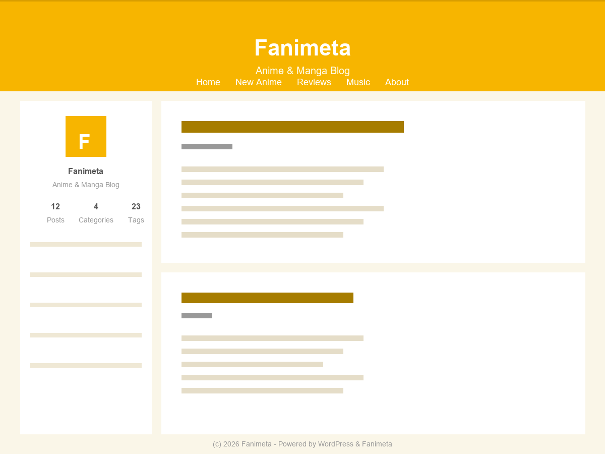

# Fanimeta

> **声明：本项目为 AI 制作的网页。** 主题的代码、样式与文档均借助 AI 完成，
> 已在真实站点上跑通验证，但请自行评估是否适用于你的场景。

> 一个「零插件」的 WordPress 动漫博客主题。黄色卡通风，开箱即用。

所有功能都写在主题内部，**不依赖任何插件、不修改 WordPress 核心** —— 整站可以随主题一起打包、迁移、纳入版本控制。



---

## 特点

### 前端

- **视觉**：黄色 header + 暖米色背景，粗黑描边与硬阴影构成的卡片化排版（配色与版式参考 yuc.wiki 的 NexT Gemini）
- **左侧个人侧边栏**：作者信息卡 + 小工具区
- **两个导航菜单**：主菜单、社交链接菜单
- **两个小工具区**：侧边栏、页脚
- **投稿页** `/submit/`：登录用户可从前台投稿，支持草稿自动保存、封面上传、字数与分类校验
- **个人主页** `/profile/`：展示个人资料、封面、头像与已发布内容
- **更新日志** `/changelog/`：按版本倒序的时间线；首页左侧栏底部有一个刻意收淡的「最近 5 条」入口

### 账号系统（自建，不依赖插件）

- 注册、登录、找回密码、重置密码全流程
- 注册与找回走**邮箱验证码**，带有效期、重发冷却、尝试次数三重限制
- 多级限流：单 IP 每小时上限、全站每日发信上限、投稿与上传各自的小时上限
- 登录与找回**统一返回中性提示**，不泄露账号是否存在

### 后台运营

| 菜单 | 作用 |
|---|---|
| 站点概览 | 发布趋势、待审数字、站点健康一览 |
| 内容审核 | 一键通过 / 驳回（附理由）/ 恢复；作者可在「我的投稿中心」自助查看状态 |
| 用户认证 | 邮箱验证状态一览与人工干预 |
| 邮件服务 | SMTP 配置状态与测试发信 |
| 数据库 | 表体积概览与 SQL 执行（带二次确认） |

---

## 环境要求

| 项 | 版本 |
|---|---|
| WordPress | 5.0 及以上（已在 6.7 测试） |
| PHP | 7.2 及以上（开发环境实测 7.3 / 7.4 / 8.2 三版本语法通过） |
| 数据库 | MySQL 5.7 / MariaDB 10.x |

---

## 安装

1. 把整个 `fanimeta` 目录放进 `wp-content/themes/`
2. 后台「外观 → 主题」启用
3. 启用时会自动创建三个页面并绑定模板：`关于` `/about/`、`投稿` `/submit/`、`个人主页` `/profile/`
4. `更新日志` `/changelog/` 在**首次访问时按需创建**（只在版本号变化后重跑一次；页面被误删，下次升级会建回来）
5. 到「设置 → 固定链接」点一次保存，让账号页的 rewrite 规则生效

> 账号页路由：`/login/`、`/register/`、`/lost-password/`、`/reset-password/`、`/logout/`。
> 固定链接若是「朴素」模式，rewrite 不生效，会自动回退成 `?fanimeta_auth=xxx` 形式。

---

## 配置

### 站点主人信息

在 `functions.php` 顶部：

```php
define( 'FANIMETA_OWNER_NAME', '站长昵称' );               // 侧边栏显示的站长名
define( 'FANIMETA_OWNER_BILIBILI_URL', 'https://...' );    // 站长 B 站主页（社交菜单用）
```

### 邮件（必配，否则注册与找回不可用）

在 `wp-config.php` 的 `/* That's all, stop editing! */` **之前**加入。下面以 QQ 邮箱为例：

```php
define( 'FANIMETA_SMTP_HOST', 'smtp.qq.com' );
define( 'FANIMETA_SMTP_PORT', 465 );
define( 'FANIMETA_SMTP_SECURE', 'ssl' );
define( 'FANIMETA_SMTP_USER', '你的邮箱@qq.com' );
define( 'FANIMETA_SMTP_PASS', '邮箱 SMTP 授权码' );          // 注意是授权码，不是登录密码
define( 'FANIMETA_SMTP_FROM', '你的邮箱@qq.com' );
define( 'FANIMETA_SMTP_FROM_NAME', '你的站点名' );
```

> ⚠️ **授权码只写在 `wp-config.php`，不要写进主题文件。**
> `wp-config.php` 不属于主题目录，这样主题目录才能安全地纳入版本控制或对外分享。
>
> ⚠️ 阿里云 ECS 默认封禁 25 端口，且 PHP 的 `mail()` 依赖本机 sendmail，实际发不出去 —— 必须走 465 / 587 这类加密端口。
>
> 💡 密码常量的名字 `FANIMETA_SMTP_PASS` 是故意混淆的，避免在代码里一眼被 grep 出「密码」。

配好后可在「邮件服务」页查看状态并**测试发信**。

### 降级：临时关掉邮箱验证

发信通道不可用时，把 `functions.php` 里的 `FANIMETA_REG_EMAIL_VERIFY` 置为 `false`，
注册流程会整块隐藏邮箱验证并跳过校验，站点仍可正常注册。

### 可调阈值

| 常量 | 默认 | 含义 |
|---|---|---|
| `FANIMETA_PASSWORD_MIN_LEN` | 10 | 密码最小长度 |
| `FANIMETA_MAIL_DAY_MAX` | 150 | 全站每日发信上限 |
| `FANIMETA_EMAIL_IP_MAX_PER_HOUR` | 10 | 单 IP 每小时发信上限 |
| `FANIMETA_SUBMIT_MAX_PER_HOUR` | 5 | 单用户每小时投稿上限 |
| `FANIMETA_UPLOAD_MAX_PER_HOUR` | 10 | 单用户每小时上传上限 |
| `FANIMETA_EMAIL_CODE_TTL` | 300 | 验证码有效期（秒） |
| `FANIMETA_EMAIL_CODE_COOLDOWN` | 60 | 验证码重发冷却（秒） |
| `FANIMETA_EMAIL_CODE_MAX_TRY` | 5 | 单个验证码最大尝试次数 |

所有常量都带 `defined()` 保护，可以整段复制到 `wp-config.php` 里覆盖。

---

## 目录结构

```
fanimeta/
├── functions.php              主题主文件：常量、setup、钩子、后台管理页
├── style.css                  主题声明 + 全部前台样式
├── header.php / footer.php
├── index.php / single.php / page.php / archive.php / search.php / 404.php / comments.php
├── sidebar.php                左侧个人侧边栏（作者信息 + 小工具 + 更新日志入口）
│
├── inc/
│   ├── auth.php               账号系统后端（注册 / 登录 / 找回，含验证码与限流）
│   ├── user-center.php        用户中心 + 封面 / 头像等 meta 常量
│   ├── admin-panel.php        内容审核工作流 + 站点概览看板
│   └── changelog.php          更新日志数据源 + 侧边栏卡片 + 独立页面
│
├── page-about.php             关于页
├── page-submit.php            投稿页
├── page-profile.php           个人主页
├── page-changelog.php         更新日志页
│
├── templates/
│   ├── auth-login.php         登录          /login/
│   ├── auth-register.php      注册          /register/
│   ├── auth-lostpassword.php  找回密码      /lost-password/
│   └── auth-resetpassword.php 重置密码      /reset-password/
│
└── assets/
    ├── css/admin.css          后台样式
    ├── css/auth.css           账号页样式
    ├── js/main.js
    ├── js/auth.js
    └── images/
```

### `inc/` 的加载顺序有依赖

`functions.php` 里按固定顺序 require，**不要调换**：

```
auth.php  →  user-center.php  →  admin-panel.php  →  changelog.php
```

- `user-center.php` 定义封面 / 头像的 meta 常量
- `admin-panel.php` 消费这些常量
- `changelog.php` 被 `sidebar.php` 调用

---

## 添加一条更新日志

只改一个文件、一处位置：`inc/changelog.php` 的 `fanimeta_changelog_data()`，
在数组**最前面**插一条（数组顺序 = 展示顺序，从新到旧）：

```php
array(
    'version' => '1.14.0',
    'date'    => '2026-10-20',
    'type'    => 'feature',   // feature 新增 / fix 修复 / polish 优化
    'title'   => '一句话说清这一版做了什么',
    'items'   => array(
        '细项一',
        '细项二',
    ),
),
```

首页左侧栏入口、`/changelog/` 时间线、每条记录的锚点链接都会自动跟着变。

---

## 开发与部署

**主题目录本身就是版本控制根目录**，源码在这里直接改、直接提交。

改动流程：

1. 本地环境全量实测（前台各页 + 后台各页都要过）
2. 提交到 git
3. 部署到服务器

> ⚠️ **`git push` ≠ 上线。** 推送到 GitHub 只是版本备份，站点更新要单独部署。

### 几个容易踩的坑

- **改了样式记得递增版本号。** `style.css` 是带版本号加载的（`style.css?ver=FANIMETA_VERSION`），
  版本号不动的话浏览器会继续用缓存里的旧 CSS，看起来像改动没生效。
- **函数名别写成变量。** 主题里所有函数都带 `fanimeta_` 前缀，误写成 `$fanimeta_xxx()` 会导致整站 500，
  而 `php -l` 语法检查**查不出这类错误**。前台 500 但 `/wp-login.php` 正常时，优先怀疑刚改的模板 / inc 文件。
- **`.gitignore` / `README.md` / `LICENSE` 只存在于 git 里**，不会部署到线上。
  做本地与线上全量 md5 比对时要排除它们，否则会误报差异。

---

## 安全设计

- 后台仅 `manage_options` 用户可进，其余角色访问 `/wp-admin/` 一律跳回首页
- `?author=` 系列查询已 301 封堵；`/author/<slug>/` 作者归档与用户 sitemap 统一 404，避免被枚举
- 登录、注册、找回全部返回中性响应，不泄露账号是否存在
- 投稿上传走白名单校验 + 频率限制；SQL 执行工具带二次确认
- 邮件验证码有有效期、冷却与尝试次数限制；发信有单 IP 与全站双重日额度
- **仓库内不含任何密钥**：所有凭据都通过 `wp-config.php` 常量注入

---

## 许可证

本项目采用 **GNU General Public License v2.0 或更新版本**（GPL-2.0-or-later）。

- 完整协议全文见仓库根目录的 [`LICENSE`](LICENSE) —— 与 [gnu.org 官方文本](https://www.gnu.org/licenses/gpl-2.0.html) 逐字节一致
- `style.css` 主题声明中标注了 `License: GNU General Public License v2 or later`
- 版权：`Copyright (C) 2026 LiZ4486`

### 这意味着什么

你可以自由使用、修改、分发本主题，包括商业用途，但需满足 GPL 的核心条件：

- **保留声明** —— 不能删除原有的版权声明与 `LICENSE` 文件
- **衍生作品同样开源** —— 分发修改版（或基于它做的主题）时，必须以 GPL v2+ 提供完整源码
- **无担保** —— 作者不对使用后果承担责任

> 一句话：随便用、随便改，但**改了再发出去，也得开源**。

### 第三方素材

排版参考自 [yuc.wiki](https://yuc.wiki)（Hexo + NexT Gemini）。NexT 主题以 MIT 协议发布，
本主题为独立实现、未直接复制其代码。若你要二次分发，请自行确认所引用素材
（头像、B 站图标矢量图等）的授权情况。
